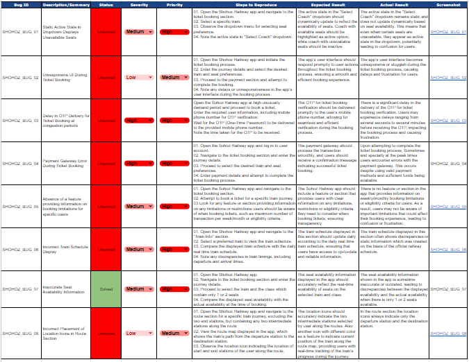

### Shohoz Railway Application Bug Report

This repository contains a bug report for the Shohoz Railway application. The bug report is provided in XLSX format and includes details of identified issues and any relevant information for developers and stakeholders.

### How to Use

1. Download the Bug Report:

    - Click on the bug report file (Shohoz_Railway_Bug_Report.xlsx) in the file list above.
    - Click the "Download" button to download the file to your local machine.

2. Viewing the Bug Report:

    - You can view the bug report using Microsoft Excel or any spreadsheet software that supports XLSX format.
    - Open the downloaded XLSX file to access the bug report.

3. Understanding the Bug Report:
    -  The bug report contains detailed information about each identified issue, including:
        - Bug ID of the issue
        - Description/Summary	
        - Status	
        - Severity	
        - Priority	
        - Steps to Reproduce	
        - Expected Result	
        - Actual Result	
        - Screenshot
### Bug Report

### Contributing
Contributions and feedback are welcome! If you identify new issues or have suggestions for improvements, please create an issue or submit a pull request.
